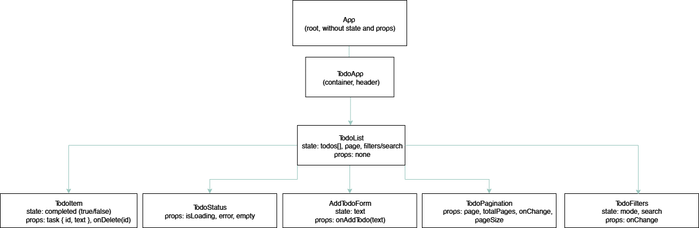

# Lab 4: Fetching Data. Custom Hooks

## Component Tree & Data Flow

### Diagram

---

## Description

### App
- Root-компонент, не має власного стану.
- Рендерить **TodoApp**.

---

### TodoApp
- Контейнер з заголовком.
- Рендерить **TodoList**.

---

### TodoList
- Використовує **useTodos** для керування даними та API-запитами.
- **State**:
  - `todos[]` – список завдань.
  - `page` – поточна сторінка.
  - `filters/search` – умови відображення.
- Рендерить:
  - **AddTodoForm** – форма додавання завдань.
  - **TodoFilters** – пошук і фільтрація.
  - **TodoStatus** – відображення станів (loading/error/empty).
  - **TodoItem[]** – список завдань.
  - **TodoPagination** – пагінація.

---

### AddTodoForm
- **State**: `text` (значення інпуту).
- **Props**: `onAddTodo(text)`.
- Викликає callback для додавання нового завдання вгору.

---

### TodoItem
- **Props**:
  - `task { id, todo, completed }`
  - `onToggle(id)`, `onDelete(id)`
- Локально управляє completed через checkbox.
- Викликає callback для оновлення або видалення завдання.

---

### TodoFilters
- **State**: `mode` (all/completed/active), `search`.
- **Props**: `onChange`.
- Дозволяє шукати та фільтрувати список завдань.

---

### TodoStatus
- **Props**: `isLoading`, `error`, `empty`.
- Відображає поточний стан:
  - `Loading…`
  - `Error`
  - `No tasks`

---

### TodoPagination
- **Props**:
  - `page`
  - `totalPages`
  - `onChange`
  - `pageSize`
- Дозволяє перемикати сторінки і змінювати кількість елементів на сторінці.

---

## Data Flow

- **Props down**:
  - `App → TodoApp`
  - `TodoApp → TodoList`
  - `TodoList → AddTodoForm (onAddTodo)`
  - `TodoList → TodoFilters (onChange)`
  - `TodoList → TodoStatus (isLoading, error, empty)`
  - `TodoList → TodoItem (task, onToggle, onDelete)`
  - `TodoList → TodoPagination (page, totalPages, onChange, pageSize)`

- **Callbacks up**:
  - `AddTodoForm → TodoList (onAddTodo(text))`
  - `TodoItem → TodoList (onToggle(id), onDelete(id))`
  - `TodoFilters → TodoList (onChange(filters))`
  - `TodoPagination → TodoList (onChange(page))`

---

## Notes
- Для роботи з API використано **Axios**.
- Реалізовано **optimistic updates** (оновлення UI до відповіді від сервера).
- Обробляються всі стани: `loading`, `error`, `empty`.
- Є **клієнтська пагінація** та можливість вибору розміру сторінки.
- Реалізована **фільтрація.**
