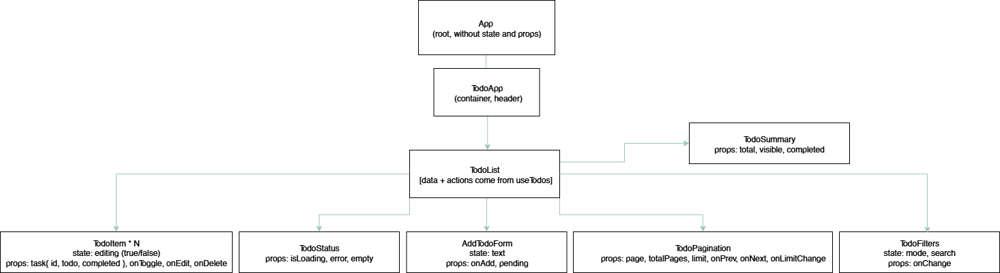

# Lab 5–6: React Design Patterns

## Component Tree & Data Flow

### Diagram

---

## Description

### App
- Root-компонент, не має власного стану чи логіки.
- Рендерить **TodoApp**.

---

### TodoApp
- Контейнер з заголовком/рамкою.
- Передає керування в **TodoList**.

---

### TodoList
- Використовує **`useTodos`** (custom hook) для всієї бізнес-логіки:
  - API-запити (`GET`, `POST`, `PUT`, `DELETE`) до DummyJSON.
  - Підтримка пагінації (`page`, `limit`, `total`).
  - Клієнтський пошук і фільтрація.
  - CRUD: додавання, редагування, видалення, toggle completed.
  - Лічильники: `total`, `visible`, `completed`.
  - Стан: `isLoading`, `error`.
- Передає дані й колбеки в підкомпоненти:
  - **AddTodoForm**
  - **TodoFilters**
  - **TodoStatus**
  - **TodoSummary**
  - **TodoItem[]**
  - **TodoPagination**

---

### AddTodoForm
- **State**: `text` (контрольований інпут).
- **Props**:
  - `onAdd(text)` – викликає callback з TodoList.
  - `pending` – індикатор під час створення нового todo.

---

### TodoItem
- **State**: `editing` (`true/false`) – редагування назви.
- **Props**:
  - `task { id, todo, completed }`
  - `onToggle(id)`
  - `onEdit(id, newTitle)`
  - `onDelete(id)`

---

### TodoFilters
- **State (локальний)**: `mode` (*all / active / completed*), `search`.
- **Props**: `mode`, `search`, `onChange`.
- Забезпечує фільтрацію та пошук на клієнті.

---

### TodoStatus
- **Props**: `isLoading`, `error`, `empty`.
- Відображає:
  - `"Loading…"`
  - `"Error"`
  - `"No tasks"`

---

### TodoSummary
- **Props**: `total`, `visible`, `completed`.
- Відображає підсумки: `Total: X`, `Visible: Y`, `Completed: Z`.

---

### TodoPagination
- **Props**:
  - `page`, `totalPages`, `limit`
  - `onPrev()`, `onNext()`, `onLimitChange(limit)`
- Відповідає за навігацію сторінками і зміну розміру сторінки.

---

## Data Flow

- **Props down**:
  - `App → TodoApp`
  - `TodoApp → TodoList`
  - `TodoList → AddTodoForm (onAdd, pending)`
  - `TodoList → TodoFilters (mode, search, onChange)`
  - `TodoList → TodoStatus (isLoading, error, empty)`
  - `TodoList → TodoSummary (total, visible, completed)`
  - `TodoList → TodoItem (task, onToggle, onEdit, onDelete)`
  - `TodoList → TodoPagination (page, totalPages, limit, onPrev, onNext, onLimitChange)`

- **Callbacks up**:
  - `AddTodoForm → TodoList (onAdd(text))`
  - `TodoItem → TodoList (onToggle, onEdit, onDelete)`
  - `TodoFilters → TodoList (onChange(mode, search))`
  - `TodoPagination → TodoList (onPrev, onNext, onLimitChange)`

---

## Patterns Used
- **Custom Hook (`useTodos`)** – інкапсуляція бізнес-логіки.
- **Container / Presentational** – чітке розділення.
- **State Colocation** – локальні UI-стани (інпут, редагування).
- **Controlled Inputs** – форми, пошук, редагування.
- **Optimistic Updates** – оновлення UI до відповіді сервера.
- **Derived State** – підрахунок total/visible/completed.
- **Composition** – компоненти-компоновки для зручності та перевикористання.
