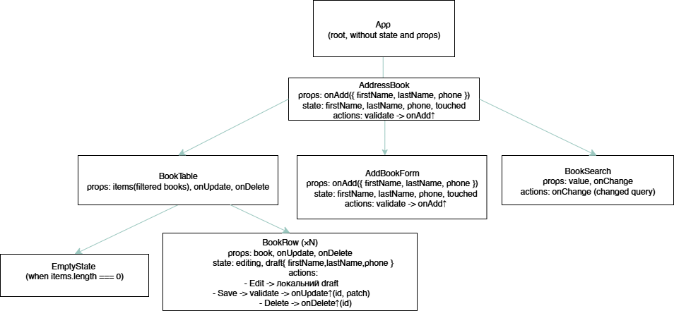

# Test 1 — Address Book

## Component Tree & Data Flow

### Diagram

### Description

#### App
- Root-компонент, рендерить **AddressBook**.

#### AddressBook
- **State**: `books[]`, `query`
- Обчислює `filtered` за `query`.
- Колбеки:
  - `add({ firstName, lastName, phone })` → додає запис (генерує `id`).
  - `update(id, patch)` → оновлює один запис.
  - `remove(id)` → видаляє запис.
- Рендерить: **AddBookForm**, **BookSearch**, **BookTable**.

#### AddBookForm
- **State**: `firstName`, `lastName`, `phone`, `touched`
- **Validation**: обов’язкові поля, повідомлення виду
  `The first name is required`, `The last name is required`, `The phone is required`.
- **Props**: `onAdd({ firstName, lastName, phone })`
- Викликає `onAdd` вгору тільки якщо всі поля валідні.

#### BookSearch
- **Props**: `value`, `onChange(value)`
- Керує рядком пошуку (controlled input).

#### BookTable
- **Props**: `items`, `onUpdate(id, patch)`, `onDelete(id)`
- Відображає `id | First Name | Last Name | Phone`.
- Порожній стан: **EmptyState** (“No data to display.”).
- Рендерить **BookRow** для кожного запису.

#### BookRow
- **Props**: `book`, `onUpdate(id, patch)`, `onDelete(id)`
- **State**: `editing`, `draft { firstName, lastName, phone }`
- Дії:
  - `Edit` → переходить у режим редагування з локальним `draft`.
  - `Save` → валідація (не порожні) → `onUpdate(id, patch)` ↑.
  - `Cancel` → скидає `draft` і виходить з редагування.
  - `Delete` → `onDelete(id)` ↑.

## Used Patterns

- **Container–Presentational**
  `App.jsx` як контейнер (знає про стан через `useBooks`),
  `BookTable.jsx` і `BookRow.jsx` — презентаційні компоненти для рендеру.

- **Custom Hook** —
  `useBooks.js` інкапсулює логіку: зберігання списку, пошук, додавання, редагування, видалення.
  Компоненти лише викликають його методи.

- **List Rendering + Stable Keys**
  `BookTable.jsx` рендерить список через `.map()` і передає у `BookRow.jsx`,
  використовуючи `key={book.id}` для стабільності DOM.

- **Row Componentization**
  `BookRow.jsx` відповідає за один рядок таблиці, включаючи редагування і валідацію.
  Це спрощує логіку і робить код більш підтримуваним.

- **Controlled Components**
  `BookForm.jsx`, `BookSearch.jsx`, `BookRow.jsx` (в режимі редагування).
  Всі інпути керуються state → `value={...}` + `onChange`.

- **State Colocation** —
  Список і пошук тримаються у `useBooks.js`,
  але локальний стан редагування (`editing`, `tempValues`) живе всередині `BookRow.jsx`.

## Validation Rules
- Обов’язкові поля: `firstName`, `lastName`, `phone`.
- Повідомлення: `The <field name> is required`.

## Empty State
- Коли список порожній — показується “No data to display.”
